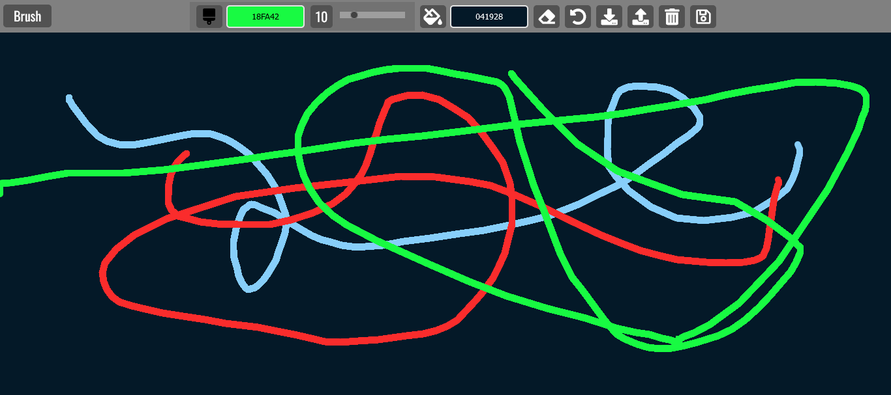

<h1>Paint Clone</h1>

<h2>A paint clone created using HTML, CSS, and JavaScript using Canvas.</h2>

This paint clone was created using HTML, CSS, and JavaScript using Canvas to allow you to draw images. This paint clone also allows you to clear your image, save it to local storage and retrieve your drawing that you saved to local storage to continue drawing, and download your drawing. Screenshot of the paint clone.

- Live Site: [Paint Clone](https://paint-clone-project.netlify.app/)

### Screenshot

